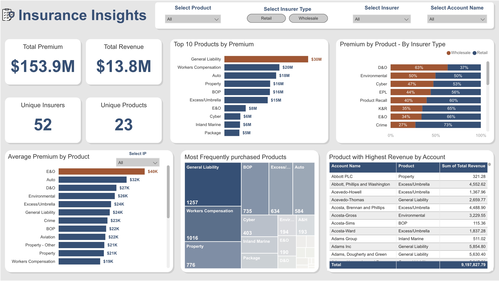

# Insurance Portfolio Analysis Dashboard

This repository contains a Power BI dashboard analyzing an insurance portfolio dataset. The goal of this project was to answer key business questions and provide meaningful insights for an insurance agency's operations.

## Table of Contents

- [Overview](#overview)
- [Key Features](#key-features)
- [Dataset Description](#dataset-description)
- [Dashboard Preview](#dashboard-preview)
- [Questions Addressed](#questions-addressed)
- [Power BI Link](#power-bi-link)
- [Usage](#usage)
- [Feedback](#feedback)

## Overview

The dashboard provides insights into the portfolio of an insurance agency by analyzing various aspects such as total premiums, revenues, product performance, and insurer segmentation. It is designed as a single-page dashboard to ensure clarity and ease of interpretation.

## Key Features

- **Summary Table:** Aggregated data showing total premiums and revenues by product and insurer type.
- **Average Premium Calculation:** Computed for each product across insurer types.
- **Key Metrics:** Visualizations highlighting top-performing products and categories.
- **Dynamic Visuals:** Interactive elements to explore data at various granularities.

## Dataset Description

The dataset includes the following columns:
- **Account Name:** The name of the individual or organization purchasing insurance.
- **Product:** The type of insurance coverage (e.g., Cyber, Property).
- **Insurer:** Name of the insurance company providing the policy.
- **Insurer Type:** Classification as "wholesale" or "retail."
- **Industry Practice:** The sector in which the account operates.
- **Premium:** The amount paid for an insurance policy.
- **Revenue:** Total income generated from the policies sold.

## Dashboard Preview

The dashboard snapshot provides an overview of the visual layout and insights generated.

## Questions Addressed

1. **Summary Table:**
   - Total premiums and revenues segmented by insurer type.
2. **Average Premium Calculation:**
   - Average premium value for each product.
3. **Top Products:**
   - Identification of products with the highest premiums and revenues.
4. **Insurer Segmentation:**
   - Evaluation of products frequently placed in wholesale vs. retail markets.
5. **Industry Practice Analysis:**
   - Insights into average premium value by industry practice.
6. **Visualization Highlight:**
   - Highlighting the top-performing product by premium in a different color.

## Power BI Link

[Access the Power BI Dashboard](https://app.powerbi.com/view?r=eyJrIjoiYTM0MmMxZGUtNjY3ZC00NWFlLTljYjktNTUxNDRkNDZmNzk2IiwidCI6ImRmODY3OWNkLWE4MGUtNDVkOC05OWFjLWM4M2VkN2ZmOTVhMCJ9)

## Feedback

I am open to feedback and suggestions! Please feel free to share your thoughts or propose improvements to the dashboard. For detailed feedback on the chess dashboard I mentioned during discussions, [access it here](#).

Thank you for your time and interest!
